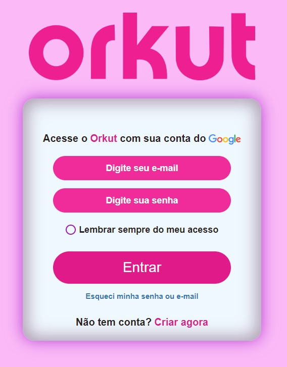

    

## Índice

1. [Sobre](#Sobre)
2. [Objetivo](#Objetivo)
3. [Tecnologias e ferramentas](#Tecnologias-e-ferramentas)
4. [Projeto](#Projeto)
5. [Desenvolvimento](#Desenvolvimento)

# Sobre

O Orkut esteve presente na vida de muitos brasileiros, criando amizades e unindo cada canto do Brasil através de suas comunidades, e agora possivelmente retornando dos mortos para triunfar novamente.

  

# Objetivo

O objetivo deste projeto é matar um pouco a saudade desta rede social que deixou de estar presente em nossas vidas.

  

# Tecnologias e ferramentas

Este projeto foi desenvolvido com HTML e CSS.

  

# Projeto

Estas são algumas demonstrações do projeto Orkut:

<h2 align="center">Página de login</h2>

  

# Desenvolvimento

Este projeto foi desenvolvido por:

## Melquisedeque Paidosz - Aluno na Kenzie Academy Brasil

[LinkedIn](https://www.linkedin.com/in/melquisedeque-paidosz-da-silva/)

[Github](https://github.com/wikeed)

  

